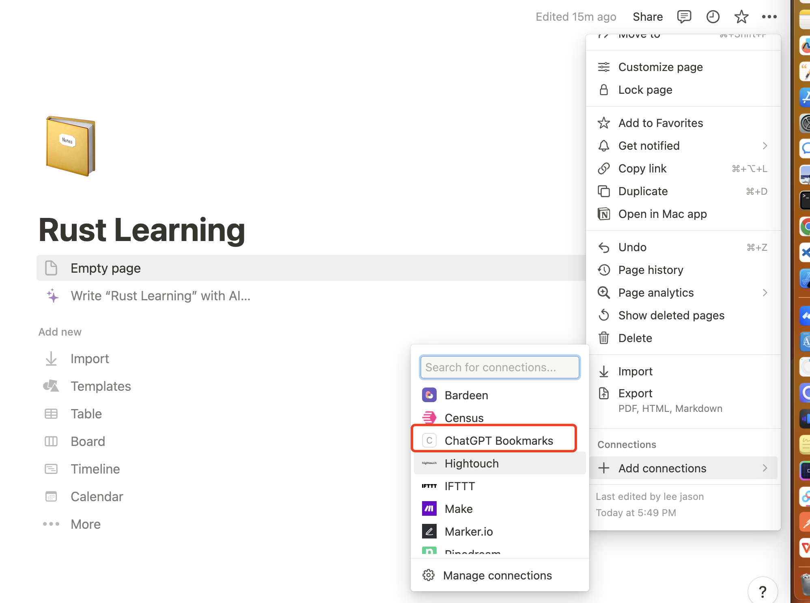

# ChatGPT 书签

一个管理 ChatGPT 对话的 Chrome 扩展。

## 🎥 预览

https://github.com/SeekingLight233/chatgpt-bookmarks/assets/44890048/dbef0898-7a2e-4b88-982d-d604a920fc3c

## 🚀 特性

- 将每个对话保存为书签。
- 将对话内容同步到 Notion。

## 📖 使用方法

### 安装

点击此处安装扩展：[Chrome 网络商店](https://chrome.google.com/webstore/detail/chatgpt-bookmarks/hagmmpbaflccbibjhbcnolbligcdildb?hl=zh-CN&authuser=0)。

### Notion 同步配置

> 目前还处于 Beta 版本，为了防止你的数据丢失，我们强烈建议你启用此功能。

1. [点击此处](https://www.notion.so/my-integrations)创建 Notion integration。
2. 创建完成后，在 Notion 页面，点击右侧的`...`，选择`Add connections`，然后找到你刚刚创建的 Notion integration.
   
3. 在 Chrome 上，右键点击 ChatGPT-Bookmarks 扩展图标，进入插件配置页面。
4. 在配置页面，填写 Notion API 密钥(Notion integration)和 Notion 页面 id。


⚠️：Notion 页面 id 是 Notion 页面 URL 中尾部的一串字符。例如，`https://www.notion.so/ChatGPT-Bookmarks-0e1b2c3d4e5f6g7h8i9j0k1l2m3n4o5p6`，Notion 页面 id 就是`0e1b2c3d4e5f6g7h8i9j0k1l2m3n4o5p6`。

## 🤝Contribution

First, run the development server:

```bash
pnpm dev
# or
npm run dev
```

Open your browser and load the appropriate development build. For example, if you are developing for t
he chrome browser, using manifest v3, use: `build/chrome-mv3-dev`.

You can start editing the popup by modifying `popup.tsx`. It should auto-update as you make changes. To add an options page, simply add a `options.tsx` file to the root of the project, with a react component default exported. Likewise to add a content page, add a `content.ts` file to the root of the project, importing some module and do some logic, then reload the extension on your browser.

For further guidance, [visit plasmo Documentation](https://docs.plasmo.com/)
